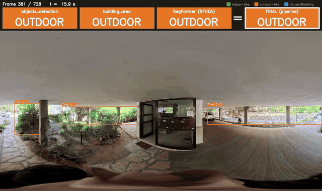

# Indoor Floor-Plan Pipeline (DFPE)

How to go from a **raw 360° video** to an **estimated floor plan**, using
either **HorizonNet** or **LGT-Net** as the layout estimator.

Two independent detectors find indoor/outdoor transitions in the video
(YOLO object cues and SegFormer segmentation). The pipeline merges them,
confirms a transition only when at least 2 sources agree, cuts the video
into indoor clips, and runs floor-plan estimation (direct_360_FPE) on each
clip.

## Demo



Video 010, about 13 s around entering and leaving a building. The top row shows
each method's per-frame decision (objects_detection, building_area, SegFormer),
then `=` the pipeline's **FINAL** decision. Boxes are the YOLO detections the
methods use: green = indoor-like objects, orange = outdoor-like, blue =
House/Building. Made with `transition_detection/visualize_classifications.py`
(see [Checking the classifications on a video](#checking-the-classifications-on-a-video)).

---

## Repository layout

```
transition_detection/          Stage A: YOLO-OIV7 indoor/outdoor transitions
  pipeline_lock_direction.py     orchestrator (one video, or every video in a folder)
  visualize_classifications.py   video showing every method's per-frame indoor/outdoor label
  object_detection/              per-frame classifiers + transition debouncing
                                 (+ standalone annotation/visualisation tools)
  extract_classes_yolo/          per-frame OIV7 class summaries
dpfe_pipeline/                 Stage C: the 7-stage floor-plan pipeline
  pipeline.py                    orchestrator
  dpfe_paths.py                  all paths in one place (see "External dependencies")
data/videos/{id}/              per-video inputs: transition_yolo.csv, transition_sfuda.csv
direct_360_FPE/                floor-plan estimation (modified copy of upstream, see below)
configs/stella_vslam/          SLAM camera configs, one per resolution/fps
experiments/                   one-off studies, not part of the pipeline
outputs/                       pipeline results (git-ignored)
```

Stage B (SegFormer / 360SFUDA) lives in a separate project, `~/360SFUDA`.

### `direct_360_FPE` provenance

A copy of [EnriqueSolarte/direct_360_FPE](https://github.com/EnriqueSolarte/direct_360_FPE)
at commit `6a41911`, with local changes to 16 files (scale recovery, room-shape
solver, the `*_coords.json` export in `utils/eval_utils.py`, config). The full
diff against upstream is in [direct_360_FPE/LOCAL_CHANGES.patch](direct_360_FPE/LOCAL_CHANGES.patch).
Upstream's `mp3d_fpe_dataset/` helper folder was removed locally (the dataset
itself is on [HuggingFace](https://huggingface.co/datasets/EnriqueSolarte/mp3d_fpe)).

---

## 0. One-time setup

### External dependencies

These are not in the repo. Default locations are under `$HOME`; each can be
overridden with the environment variable shown (read by `dpfe_paths.py`).

| Dependency | Default location | Env var | Source |
|---|---|---|---|
| HorizonNet | `~/HorizonNet` | `HORIZONNET_DIR` | [sunset1995/HorizonNet](https://github.com/sunset1995/HorizonNet) @ `c9a7df9` |
| LGT-Net | `~/LGT-Net` | `LGTNET_DIR` | [zhigangjiang/LGT-Net](https://github.com/zhigangjiang/LGT-Net) @ `0045359` |
| stella_vslam (library) | installed to `/usr/local/lib` | – | [stella-cv/stella_vslam](https://github.com/stella-cv/stella_vslam) @ `8ac1be4` |
| stella_vslam_examples `run_image_slam` | `~/stella_vslam_examples/build/run_image_slam` | `STELLA_SLAM_BIN` | [stella-cv/stella_vslam_examples](https://github.com/stella-cv/stella_vslam_examples) @ `defc69e` |
| ORB vocabulary | `~/orb_vocab.fbow` | `ORB_VOCAB` | [stella-cv/FBoW_orb_vocab](https://github.com/stella-cv/FBoW_orb_vocab) |
| venv interpreter | `~/venv/bin/python` | `DFPE_VENV_PY` | see below |

### Model checkpoints

| Model | Path |
|---|---|
| HorizonNet (mp3d) | `~/HorizonNet/ckpt/resnet50_rnn__mp3d.pth` |
| LGT-Net (mp3d) | `~/LGT-Net/checkpoints/SWG_Transformer_LGT_Net/mp3d/best.pkl` |
| YOLO OIV7 | `~/yolov8l-oiv7.pt` |

### Python environments

| Env | Used by | Key packages |
|---|---|---|
| `~/venv` (Python 3.12) | `transition_detection/`, all `dpfe_pipeline/` glue scripts | `ultralytics` 8.3.241, `opencv-python`, `pandas`, `numpy`, `scipy`, `matplotlib`, `tqdm` |
| conda `dfpe` | `run_horizonnet.py`, `run_dfpe.py` → `direct_360_FPE/main_eval_scene.py` | `torch` 2.4.1+cu118, HorizonNet deps, `direct_360_FPE/requirements.txt` |
| conda `lgtnet` | `run_lgtnet.py` (imports LGT-Net source) | `torch==1.7.1`, `LGT-Net/requirements.txt` |
| conda `sfuda` | `~/360SFUDA/pipeline_master.py` | Python 3.8, `torch` 1.12.1+cu113, `mmcv-full`, `timm`, `transformers` |

```bash
# dfpe (HorizonNet + direct_360_FPE)
conda create -n dfpe python=3.9 -y && conda activate dfpe
pip install torch --index-url https://download.pytorch.org/whl/cu118
pip install -r direct_360_FPE/requirements.txt
pip install -e direct_360_FPE

# lgtnet
conda create -n lgtnet python=3.8 -y && conda activate lgtnet
pip install -r ~/LGT-Net/requirements.txt
```

### SLAM binary

Build and install stella_vslam first (see its README), then:

```bash
cd ~/stella_vslam_examples
mkdir -p build && cd build
cmake .. -DCMAKE_BUILD_TYPE=Release
make -j"$(nproc)"
```

**The SLAM camera config's `cols`/`rows` must equal the extracted frames' pixel
size exactly.** `extract_indoor_clips.py` writes frames at the video's native
resolution, so the config must match the source video. `run_slam.py` picks a
config from `configs/stella_vslam/` by resolution and fps:

| Config | Resolution | fps |
|---|---|---|
| `config_fps30_5760.yaml` (default) | 5760×2880 | 30 |
| `config.yaml` | 5760×2880 | 24 |
| `config_fps30_1920.yaml` | 1920×960 | 30 |
| `config_fps30.yaml`, `config_fps15.yaml` | 1024×512 | 30 / 15 (old downscaled tests) |
| `config_fps1.yaml` | 5760×2880 | 1 |

For a new resolution/fps, copy `config_fps30_5760.yaml`, set `Camera.cols`,
`Camera.rows` and `Camera.fps` (check with `ffprobe`), and pass it with
`run_slam.py --config`. The video **must be equirectangular (360°)**.

---

## 1. Quick start

All commands run from the repo root.

```bash
VIDEO=~/lock_direction/new_lock_direction/VID_20260603_161558_00_097.mp4
ID=097

# Stage A: YOLO transitions -> ~/pipeline_output/{video_stem}/transitions.csv
~/venv/bin/python transition_detection/pipeline_lock_direction.py --video "$VIDEO"
mkdir -p data/videos/$ID
cp ~/pipeline_output/$(basename "$VIDEO" .mp4)/transitions.csv data/videos/$ID/transition_yolo.csv

# Stage B: SegFormer transitions (see step 3 below) -> data/videos/$ID/transition_sfuda.csv

# Stage C: floor plans
~/venv/bin/python dpfe_pipeline/pipeline.py --video "$VIDEO" --layout_model horizonnet
# LGT-Net instead:
~/venv/bin/python dpfe_pipeline/pipeline.py --video "$VIDEO" --layout_model lgtnet \
    --results_root outputs/dfpe_results_lgt
```

`--video_dir` defaults to `data/videos/{ID}`. Use a separate `--results_root`
per layout model: both variants share the same clips, so their DFPE outputs
land in the same `{id}_{n}` folders otherwise.

Results land in `outputs/dfpe_results/{ID}_{clip_index}/`, one folder per
indoor clip.

---

## 2. Step by step for a new video

### Step 1: Drop the video in

Any location works. By convention, raw videos live in `~/lock_direction/new_lock_direction/`.

### Step 2: `transition_yolo.csv`

```bash
~/venv/bin/python transition_detection/pipeline_lock_direction.py --video path/to/video.mp4
# or every video in a folder (default ~/lock_direction/new_lock_direction):
~/venv/bin/python transition_detection/pipeline_lock_direction.py --videos_dir path/to/folder
```

Inference is skipped for any video whose `oiv7_detections.csv` already exists
(`SKIP_EXISTING = True`). For each video it writes to
`{--output_dir}/{video_stem}/` (default `~/pipeline_output/`):
- `oiv7_detections.csv`: raw per-frame detections
- `indoor_outdoor_classification.csv`: "building_area" method
- `indoor_outdoor_objects_classification.csv`: "objects_detection" method
- `transitions.csv`: columns `frame_id, direction, method`

Copy `transitions.csv` to `data/videos/{ID}/transition_yolo.csv`.

### Step 3: `transition_sfuda.csv`

```bash
conda run -n sfuda python ~/360SFUDA/pipeline_master.py \
    --input_video  ~/lock_direction/new_lock_direction/VID_..._097.mp4 \
    --output_base  ~/sfuda_out/097 \
    --weights      ~/360SFUDA/pre_trained_weights/city_b2_52.99.pth \
    --fps 30
cp ~/sfuda_out/097/transition_report.csv data/videos/097/transition_sfuda.csv
```

Output columns: `transition_frame, type, sky_pct, veg_pct, car_pct, range_start, range_end`.

### Step 4: Run the pipeline

```bash
~/venv/bin/python dpfe_pipeline/pipeline.py --video ~/lock_direction/new_lock_direction/VID_..._097.mp4 --layout_model horizonnet
```

| Stage | horizonnet | lgtnet |
|---|---|---|
| 1 | merge_transitions | merge_transitions |
| 2 | extract_indoor_clips | extract_indoor_clips |
| 3 | HorizonNet (all frames) | SLAM |
| 4 | SLAM | setup_scene |
| 5 | setup_scene | LGT-Net (keyframes only) |
| 6 | DFPE | DFPE |
| 7 | generate_maps | generate_maps |

`--from_stage N` / `--to_stage N` run a sub-range.

### Step 5 (optional): Visualisations

These are not part of the 7 stages:

```bash
# Top-down GIF of the map being built
~/venv/bin/python dpfe_pipeline/generate_map_animation.py --results_dir outputs/dfpe_results/097_0

# Extra "unified" floor plan (all walls, no room separation)
~/venv/bin/python dpfe_pipeline/generate_maps.py --results_dir outputs/dfpe_results/097_0 --unified

# Side-by-side video: original + indoor/outdoor banner | SLAM GIF / final map
~/venv/bin/python dpfe_pipeline/visualize_video_map_animated.py \
    --video ~/lock_direction/new_lock_direction/VID_..._097.mp4 --video_dir data/videos/097 \
    --output outputs/097_indoor_map_viz.mp4
```

### Checking the classifications on a video

After Steps 2 and 3, render a video that shows, frame by frame, a big
INDOOR/OUTDOOR block per method (objects_detection, building_area, SegFormer
after its 3 s smoothing), then `= FINAL`: the pipeline's own decision
(stages 1-2: ≥2 sources agree, then the clip boundaries), plus the YOLO boxes
the methods rely on:

```bash
~/venv/bin/python transition_detection/visualize_classifications.py \
    --video          path/to/VID_..._010.mp4 \
    --detections_dir ~/pipeline_output/VID_..._010 \
    --sfuda_csv      /mnt/sfuda_out/010/frame_object_stats.csv \
    --output         /mnt/sfuda_out/010/classifications_010.mp4
```

Needs `~/360SFUDA` (or `SFUDA_DIR`) for SegFormer's decision rule.

Add `--only building` for just building_area and the House/Building boxes
(no FINAL block; `--sfuda_csv` not needed), or `--only others` for
objects_detection + SegFormer with the indoor/outdoor-like boxes. FINAL always
uses all 3 sources, since that is what the pipeline does.

---

## 3. Detection and transition logic

### 3.1 `pipeline_lock_direction.py` (orchestrator)

For each video (`--video`, or every video in `--videos_dir`):

1. Loads `yolov8l-oiv7.pt` once and streams frames with `cv2.VideoCapture`.
2. Runs `model.predict(frame, conf=0.01, iou=0.7)`. The near-zero threshold is
   deliberate: the classifiers downstream do their own filtering.
3. Writes `oiv7_detections.csv`: `frame_id, class_id, class_name, conf, x1, y1, x2, y2, area_pct`
   (`area_pct` = bbox area / frame area × 100).
4. Imports and calls (via `importlib`): `find_indoor_area.classify_frames` →
   `find_indoor_objects.classify_frames_by_objects` → `detect_transitions.detect_transitions`.

### 3.2 `find_indoor_area.py` ("building_area")

A frame is **indoor** iff some detection has `class_name` ∈ {House, Building},
`area_pct > 98.0` (the constant `AREA_PCT_THRESHOLD`; the docstring's "90%" is
stale) and `conf >= 0.25`. It fires only when a wall fills almost the whole
frame, so it has high precision and low recall. No temporal smoothing here.

Output: `indoor_outdoor_classification.csv` (`frame_id, classification`).

### 3.3 `find_indoor_objects.py` ("objects_detection")

Counts detections with `conf >= 0.1` against two sets:

- `INDOOR_LIKE`: Chair, Couch, Bed, Table, Toilet, Sink, Refrigerator, TV,
  Laptop, Microwave, Oven, Closet, Cabinetry, Bathtub, Shower, Mirror, Window,
  Door, Stairs, Furniture, …
- `OUTDOOR_LIKE`: Tree, Car, Street light, Stop sign, Traffic light/sign, Road,
  Bus, Truck, Bicycle.

More indoor objects → `indoor`; more outdoor → `outdoor`; a tie or no
qualifying objects → **carry forward the previous frame's label** (frame 0
starts as `outdoor`).

Output: `indoor_outdoor_objects_classification.csv`.

### 3.4 `detect_transitions.py` (per-frame labels → events)

Runs over both classification CSVs. When the label changes at frame `i`, the
next `MIN_RUN = 10` frames must all hold the new label to confirm a transition
(`OUT_TO_IN` / `IN_TO_OUT`) at frame `i`.

Output: `transitions.csv` (`frame_id, direction, method`), which becomes
`data/videos/{ID}/transition_yolo.csv`.

### 3.5 `merge_transitions.py` (pipeline stage 1)

Combines `objects_detection`, `building_area` (YOLO) and `sfuda`:

- Chain-clusters same-direction events: an event joins a cluster if it is
  within `RADIUS = 100` frames of the cluster's last event.
- A cluster is confirmed if it has `>= MIN_SOURCES = 2` distinct sources.
  Keep this at 2: 3 silently drops real 2-source detections.
- `_resolve_overlaps()` collapses near-identical opposite-direction clusters
  (the same real crossing seen both ways): prefer the side sfuda voted for,
  then more sources, then the tighter frame span.

Output: `transitions_confirmed.csv` (`direction, frame_min, frame_max, sources, n_sources`).

### 3.6 `extract_indoor_clips.py` (pipeline stage 2)

- `OUT_TO_IN` → indoor segment starts at `frame_max`
- `IN_TO_OUT` → segment ends at `frame_min - 1`
- If the first confirmed event is `IN_TO_OUT`, frame 0 is treated as indoor.

Writes `clips/clip_NNN/rgb/frame_{id:06d}.jpg` plus `indoor_segments.csv`.

### 3.7 Data flow

```
video ──YOLO(conf=0.01)──▶ oiv7_detections.csv
                              ├─▶ find_indoor_area    (>98% area, House/Building, conf≥0.25) ─▶ indoor_outdoor_classification.csv
                              └─▶ find_indoor_objects (count-based, carry-forward on ties)   ─▶ indoor_outdoor_objects_classification.csv
                                        both ─▶ detect_transitions (10-frame debounce) ─▶ transition_yolo.csv (2 methods)
video ──SegFormer(sfuda)──────────────────────────────────────────────────────────────▶ transition_sfuda.csv (1 method)

transition_yolo.csv + transition_sfuda.csv ─▶ merge_transitions (100-frame clustering, ≥2 sources) ─▶ transitions_confirmed.csv
                                                                                                          │
                                                                extract_indoor_clips (conservative bounds) ─▶ clip_NNN/rgb/*.jpg
                                                                                                          │
                                                                       HorizonNet/LGT-Net → SLAM → setup_scene → DFPE → maps
```

---

## 4. Output

```
outputs/dfpe_results/
  {id}_0/
    {id}_0_coords.json             ← room corners, wall planes, scale, camera trajectory
    {id}_0_map_final_fp.png        ← estimated room polygons
    {id}_0_map_scale_recovery.png  ← wall-density occupancy heatmap
    {id}_0_map_wall_planes.png     ← RANSAC wall segments
    {id}_final_fp.png, scale_recovery.jpg, results.csv, ...   (DFPE's own renders)
  {id}_1/
    ...
```

---

## 5. Troubleshooting

- **Re-running only checks that outputs exist, not whether inputs changed.**
  Every stage skips if its output file exists. After editing
  `transition_yolo.csv` / `transition_sfuda.csv`, delete
  `data/videos/{id}/transitions_confirmed.csv`, `data/videos/{id}/clips/` and
  `outputs/dfpe_results*/{id}_*` to force a real re-run. An **empty**
  `transitions_confirmed.csv` also counts as "done" and yields no clips.
- **"no clips found" at stage 2**: `transitions_confirmed.csv` is empty, so the
  sources never agreed within `RADIUS` frames. Compare the frame numbers in
  the two input CSVs by eye.
- **No `frame_trajectory.txt` after SLAM**: usually a camera-config mismatch
  (see §0) or too little texture/motion in the clip.
- **LGT-Net stage does nothing**: it needs `vo_final/keyframe_list.txt`, so
  SLAM and setup_scene must finish first.
- **A long batch stopped with no error**: usually the session was killed.
  Just re-run the same command; finished stages are skipped.
- **Two runs on the same clip give different rooms**: expected. DFPE's
  room-shape solver (`room_shape_estimator.py`, `plane_estimator.py`) uses
  unseeded `np.random`; on video 097, two DFPE runs on identical inputs gave
  room corners up to 9.5 m apart (scale and wall planes were identical).
  SLAM is also multi-threaded and not bit-for-bit repeatable. Compare results
  across several runs rather than trusting a single run.

---

## 6. Experiments

Not part of the pipeline. They are kept for reference and depend on run data
that is not in the repo.

- `experiments/slam_scale_study/`: SLAM trajectory vs. MP3D-FPE ground truth
  on scene `1LXtFkjw3qL` (scale ratios, run-to-run comparisons). Reads
  `direct_360_FPE/slam_output/` and `direct_360_FPE/mp3d_fpe_dataset/`.
- `experiments/room_overlap_clipping/clip_room_overlaps.py`: removes overlaps
  between DFPE room polygons with Shapely (tried on video033/035 with LGT-Net).

---

## Original repositories and resources

### Used by the pipeline

| Repository | What it is used for here |
|---|---|
| [EnriqueSolarte/direct_360_FPE](https://github.com/EnriqueSolarte/direct_360_FPE) | Floor-plan estimation (DFPE); a modified copy is in `direct_360_FPE/` |
| [sunset1995/HorizonNet](https://github.com/sunset1995/HorizonNet) | Room-layout model (default) |
| [zhigangjiang/LGT-Net](https://github.com/zhigangjiang/LGT-Net) | Room-layout model (alternative) |
| [stella-cv/stella_vslam](https://github.com/stella-cv/stella_vslam) | Visual SLAM library (camera trajectory) |
| [stella-cv/stella_vslam_examples](https://github.com/stella-cv/stella_vslam_examples) | `run_image_slam`, the SLAM program the pipeline calls |
| [stella-cv/FBoW_orb_vocab](https://github.com/stella-cv/FBoW_orb_vocab) | ORB vocabulary file for SLAM |
| [ultralytics/ultralytics](https://github.com/ultralytics/ultralytics) | YOLO object detection (`yolov8l-oiv7.pt`, Open Images V7 classes) |
| [zhengxuJosh/360SFUDA](https://github.com/zhengxuJosh/360SFUDA) | Panoramic semantic segmentation for Stage B (SegFormer-B2 weights `city_b2_52.99.pth`) |
| [NVlabs/SegFormer](https://github.com/NVlabs/SegFormer) | The segmentation architecture behind the 360SFUDA weights |

### Datasets

| Resource | What it is used for here |
|---|---|
| [MP3D-FPE (HuggingFace)](https://huggingface.co/datasets/EnriqueSolarte/mp3d_fpe) | Reference scene `1LXtFkjw3qL` for the SLAM/scale experiments in `experiments/slam_scale_study/` |

### Explored during the project (not used by the final pipeline)

| Repository | |
|---|---|
| [EnriqueSolarte/robust_360_8PA](https://github.com/EnriqueSolarte/robust_360_8PA) | Camera-pose estimation for 360° images |
| [DepthAnything/Video-Depth-Anything](https://github.com/DepthAnything/Video-Depth-Anything) | Video depth estimation |
| [mvlchallenge/mvl_toolkit](https://github.com/mvlchallenge/mvl_toolkit) | Multi-view layout toolkit |
| [EnriqueSolarte/ray_casting_mlc](https://github.com/EnriqueSolarte/ray_casting_mlc) | Multi-view layout consistency (self-training) |
